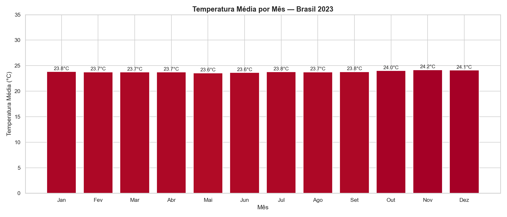
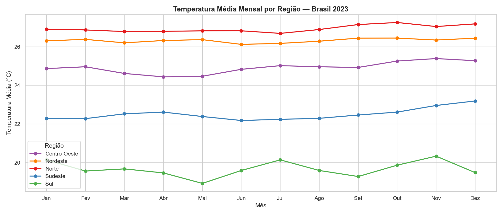
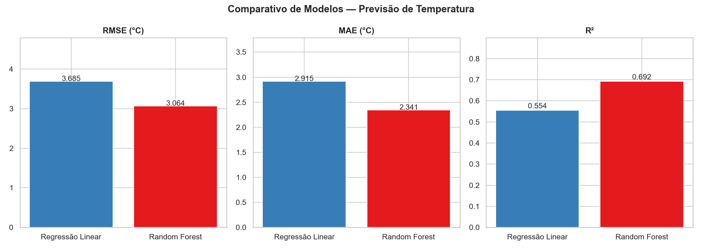
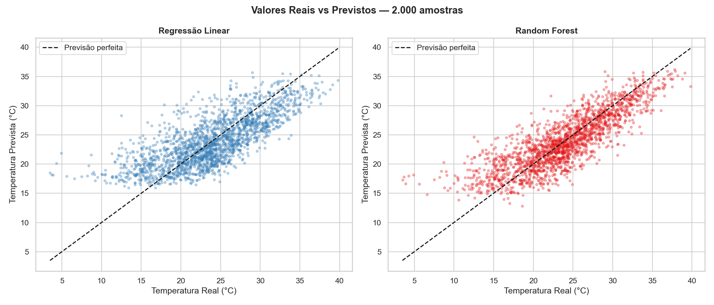
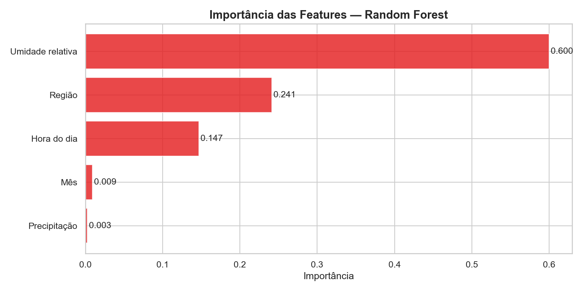

## Climate Data Pipeline 🌦️

Pipeline completo de extração, análise e modelagem preditiva de dados climáticos
brasileiros com Python e Machine Learning.

## Sobre o projeto

Coleta e processa dados históricos do INMET (Instituto Nacional de Meteorologia),
realizando tratamento, análise exploratória, análise regional e modelagem preditiva
de temperatura e precipitação de **567 estações meteorológicas** brasileiras.

**Volume de dados:** ~4,5 milhões de registros processados (2023)

## Notebooks

| Notebook | Descrição |
|---|---|
| `01_temperaturas.ipynb` | Análise de temperaturas extremas e precipitação |
| `02_mapa_temperaturas.ipynb` | Mapa interativo de temperaturas por estação |
| `03_analise_regioes.ipynb` | Comparativo climático entre as 5 regiões do Brasil |
| `04_modelagem_ml.ipynb` | Modelagem preditiva com Regressão Linear e Random Forest |

## Resultados de Machine Learning

| Modelo | RMSE | MAE | R² |
|---|---|---|---|
| Regressão Linear | 3.69°C | 2.92°C | 0.55 |
| Random Forest | 3.06°C | 2.34°C | 0.69 |

A feature mais importante foi a **umidade relativa (60%)**, seguida de região (24%)
e hora do dia (15%).

## Visualizações

### Mapa interativo de temperaturas


### Temperaturas por região


### Comparativo de modelos


### Valores reais vs previstos


### Importância das features


## Estrutura

climate-data-pipeline/
│
├── data/                  # Dados e visualizações (CSVs não versionados)
├── notebooks/             # Análises em Jupyter Notebook
│   ├── 01_temperaturas.ipynb
│   ├── 02_mapa_temperaturas.ipynb
│   ├── 03_analise_regioes.ipynb
│   └── 04_modelagem_ml.ipynb
├── src/                   # Scripts Python
│   ├── extractor.py       # Download e leitura dos dados do INMET
│   ├── processor.py       # Limpeza, validação e transformação
│   └── stations.py        # Extração de coordenadas geográficas
├── requirements.txt       # Dependências do projeto
└── README.md

## Tecnologias

- Python 3.14 · Pandas · NumPy
- Matplotlib · Seaborn · Folium
- Scikit-learn (Linear Regression, Random Forest)
- Jupyter Notebook · Git

## Como executar

```bash
pip install -r requirements.txt
python src/extractor.py        # baixa e extrai os dados do INMET
jupyter notebook               # abre os notebooks de análise
```

## Fonte dos dados

INMET — Instituto Nacional de Meteorologia
https://portal.inmet.gov.br/dadoshistoricos