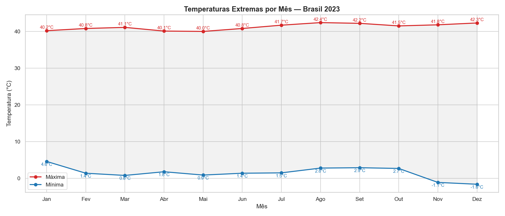
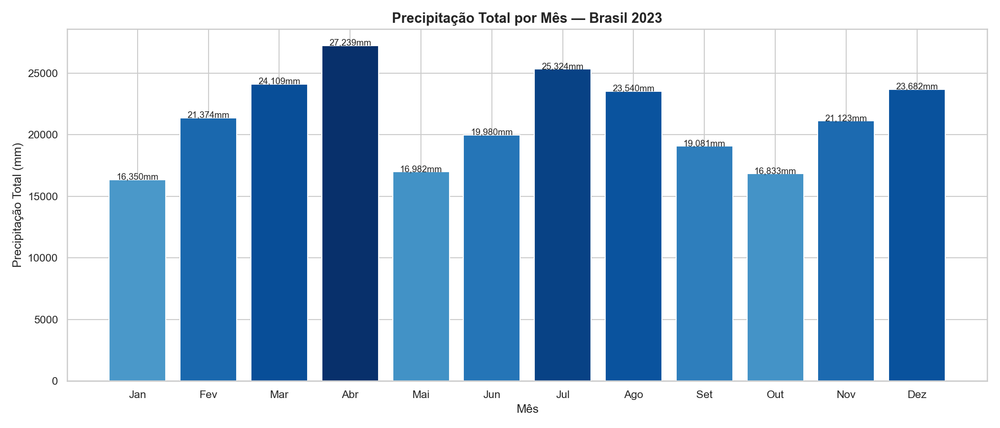
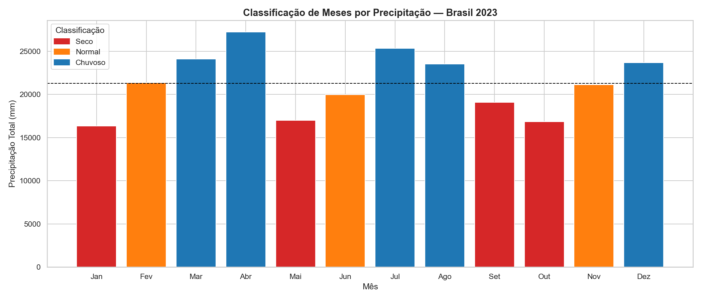

# Climate Data Pipeline 🌦️

Pipeline de extração, análise e modelagem de dados climáticos brasileiros com Python.

## Sobre o projeto

Coleta e processa dados históricos do INMET (Instituto Nacional de Meteorologia),
realizando tratamento, análise exploratória e modelagem estatística sobre
temperatura e precipitação de 567 estações meteorológicas brasileiras.

**Volume de dados:** ~4,5 milhões de registros processados (2023)

## Análises realizadas

### Temperatura média por mês


### Temperaturas extremas


### Precipitação por mês


### Classificação de meses (seco/normal/chuvoso)


## Estrutura

climate-data-pipeline/
│
├── data/               # Dados brutos e processados
├── notebooks/          # Análises em Jupyter Notebook
├── src/                # Scripts Python
├── requirements.txt    # Dependências do projeto
└── README.md

## Tecnologias

- Python 3.14
- Pandas
- Matplotlib / Seaborn
- Scikit-learn
- Jupyter Notebook

## Tecnologias

- Python 3.14
- Pandas
- Matplotlib / Seaborn
- Scikit-learn
- Jupyter Notebook

## Como executar

```bash
pip install -r requirements.txt
python src/extractor.py   # baixa e extrai os dados
jupyter notebook          # abre os notebooks de análise
```

## Fonte dos dados

INMET — Instituto Nacional de Meteorologia
https://portal.inmet.gov.br/dadoshistoricos